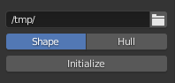
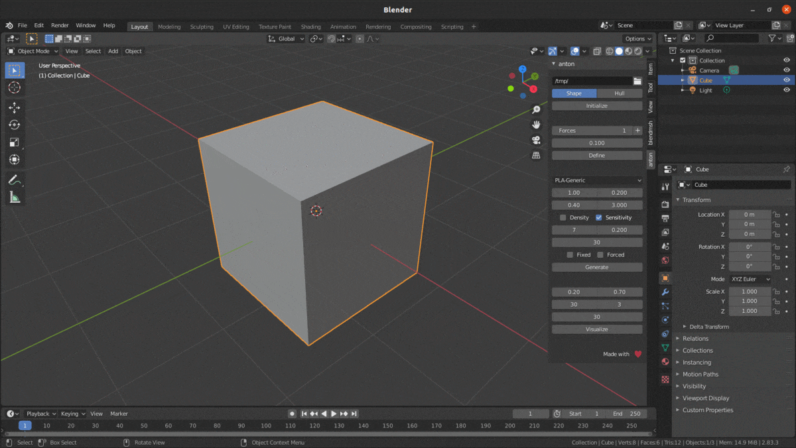
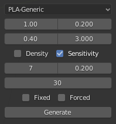

Quickstart
==========

Initialize
----------

* Design space can be initialized via two modes.
* ``SHAPE`` defines existing geometry (can be imported as well) as design space.
* ``HULL`` forms a convexhull excluding existing objects.
* Design space is then saved as a ``.stl`` file under the specified ``workspace_path``

|

|

Define
------
.. figure:: ./def.png
    :figwidth: 32%
    :align: right

* Specify the ``number of forces`` acting on the object.
* Assign ``materials`` to face(s) corresponding to each force, fixed and non-design space.
* Assign ``vertex groups`` to edges that depict the direction of each corresponding force.
* Input the ``magnitude`` and click the ``Expand`` button to visualize and change direction of each applied force.
* Specify the ``maximum element size`` for tetrahedral finite element mesh generation and click ``Define``

|

.. image:: ./define.gif
   :alt: Define

|

Generate
--------

* Select a ``material`` for the object.
* Specify optimization parameters:
    * ``Emin``
    * ``Density change``
    * ``Volumina ratio``
    * ``Penalty exponent``

* Specify filter parameters:
    * ``Number of neighbours``
    * ``Neighbourhood radius``

* Read more about these parameters `here. <scripts.html#module-properties>`_
* For a conceptual understanding of these parameters, read `Material interpolation schemes in topology optimization. <https://www.researchgate.net/publication/225613840_Material_interpolation_schemes_in_topology_optimization>`_
* Input the ``number of iterations`` and click ``Generate``

|

Visualize
---------

.. figure:: ./viz.png
    :figwidth: 32%
    :align: right

* Specify ``radius`` and ``sensitivity`` of the `metaballs. <https://docs.blender.org/manual/en/latest/modeling/metas/introduction.html>`_
* Input the ``number of keyframes`` and ``instantiation points`` for animation.
* Mention which iteration to visualize and click ``Visualize``.
* The generated metaball object can then be converted into a mesh via ``Object`` -> ``Covert to`` -> ``Mesh from Curve/Meta/Surf/Text``
* A ``Smooth Corrective`` modifier can then be applied on the mesh during export.

|

.. image:: ./visualize.gif
   :alt: Visualize

|